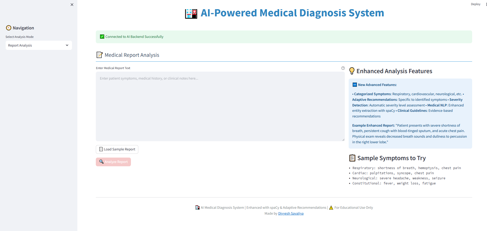

# 🏥 AI-Powered Medical Diagnosis System

An advanced web-based AI system that analyzes X-ray/MRI images and medical reports to predict diseases using deep learning techniques. **Enhanced with spaCy NLP and adaptive clinical recommendations.**


## 🆕 What's New

### 🧠 Enhanced Medical NLP
- **spaCy Integration**: Professional-grade medical text processing
- **scispaCy Support**: Specialized medical entity recognition
- **Categorized Analysis**: Symptoms grouped by medical systems
- **Severity Detection**: Automatic assessment of symptom severity

### 🎯 Adaptive Clinical Recommendations
- **Symptom-Specific**: Recommendations tailored to identified symptoms
- **Evidence-Based**: Guidelines based on clinical protocols
- **Urgency Levels**: Automatic priority assessment
- **Multi-System**: Comprehensive workup suggestions

## 🌟 Features

### 🖼️ Medical Image Analysis
- **X-ray Analysis**: Detect pneumonia, COVID-19, tuberculosis, and lung conditions
- **MRI Analysis**: Identify brain tumors, strokes, and neurological conditions
- **Real-time Processing**: Fast image processing with instant results
- **Confidence Scoring**: AI confidence levels for each diagnosis

### 📝 Enhanced Medical Report Analysis
- **🆕 Categorized Symptoms**: Respiratory, cardiovascular, neurological, GI, constitutional
- **🆕 Adaptive Recommendations**: Specific to identified symptoms and conditions
- **🆕 Severity Assessment**: Intelligent risk scoring with severity indicators
- **🆕 Medical Entity Extraction**: Advanced NLP with spaCy/scispaCy
- **🆕 Clinical Guidelines**: Evidence-based diagnostic and treatment suggestions

### 🔬 Combined Analysis
- **Multi-modal Input**: Analyze both images and reports simultaneously
- **Integrated Insights**: Combined confidence and risk assessment
- **Comprehensive Reports**: Detailed analysis with enhanced visualizations

### 📊 Interactive Visualizations
- **🆕 Symptom Category Charts**: Visual breakdown by medical systems
- **🆕 Severity Indicators**: Color-coded severity level display
- **Probability Charts**: Disease probability distributions
- **Risk Gauges**: Visual risk assessment indicators
- **Interactive Dashboard**: User-friendly medical interface

## 🚀 Quick Start

### Prerequisites
- Python 3.8 or higher
- pip package manager
- 4GB RAM minimum (8GB recommended)

### Installation

1. **Clone the repository**
```bash
git clone https://github.com/divyesh099/Hackathon-Repo-Round-2
cd medical-diagnosis-ai
```

2. **Install dependencies**
```bash
pip install -r requirements.txt
```

3. **Install spaCy models (for enhanced NLP)**
```bash
python -m spacy download en_core_web_sm
# For medical entities (optional):
pip install https://s3-us-west-2.amazonaws.com/ai2-s2-scispacy/releases/v0.5.3/en_core_sci_sm-0.5.3.tar.gz
```

4. **Start the application**
```bash
python run.py
```

5. **Access the application**
- Frontend: http://localhost:8501
- Backend API: http://localhost:8000
- API Documentation: http://localhost:8000/docs

## 🧠 Enhanced AI Models

### Medical Text Analysis

**Symptom Categories:**
- **Respiratory**: cough, shortness of breath, dyspnea, chest pain, wheezing, sputum, hemoptysis
- **Cardiovascular**: chest pain, palpitations, syncope, edema, cyanosis, murmur
- **Neurological**: headache, dizziness, seizure, weakness, numbness, confusion
- **Constitutional**: fever, fatigue, weight loss, night sweats, chills, malaise
- **Gastrointestinal**: nausea, vomiting, diarrhea, abdominal pain, dysphagia
- **Infectious**: fever, chills, sweats, lymphadenopathy, erythema

## 🛠️ Enhanced Technology Stack

### Backend
- **FastAPI**: Modern, fast web framework
- **🆕 spaCy**: Industrial-strength NLP
- **🆕 scispaCy**: Medical and scientific text processing
- **TensorFlow/PyTorch**: Deep learning frameworks
- **OpenCV**: Computer vision library
- **Transformers**: NLP model library
- **NumPy/Pandas**: Data processing

### Frontend
- **Streamlit**: Web app framework
- **🆕 Enhanced Visualizations**: Categorized symptom charts
- **Plotly**: Interactive visualizations
- **PIL**: Image processing
- **Requests**: HTTP client

## 🤝 Contributing

### New Development Areas
- Medical terminology expansion
- Clinical guideline integration
- Drug interaction checking
- Differential diagnosis algorithms
- Medical image segmentation
- Integration with FHIR standards

---

# UI overview
## Home

## Report Analysis

## Image Analysis

## Report Image Analysis

#

**Built with ❤️ by divyesh savaliya, for the PyHackathon competition.**
